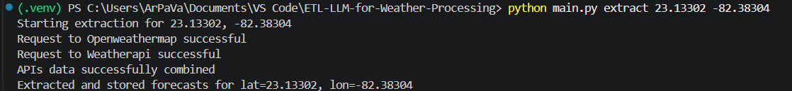

# ETL-LLM-for-Weather-Processing
In the project we are gonna combine 2 weather APIs to obtain info about the weather from a certain location given its latitude and longitude, and using a LLM we are gonna generate a list of suitabilitys for certain activities given the weather conditions, all of that will be stored in postgreSQL tables.
## 1. Installation
### 1.1 Create the virtual enviroment

```bash
python -m venv .venv
```

### 1.2 Activate the virtual enviroment

**PowerShell:**

```powershell
.\.venv\Scripts\Activate.ps1
```

**CMD:**

```bat
.\.venv\Scripts\activate.bat
```

### 1.3 Install dependencies

```bash
pip install -r requirements.txt
```

### 1.4 Deactivate the virtual enviroment

```bash
deactivate
```

### 1.5 Usage

To ingest weather for a location:
```bash
python main.py extract latitude longitude
```
To run the LLM recommendation step:
```bash
python main.py recommend amount_of_calls
```
## 2. Execution examples
Example of ETL for the data coming from the APIs:



Example of ETL of the weather forecast from the database to add activities suitability assessments using LLM agents:

